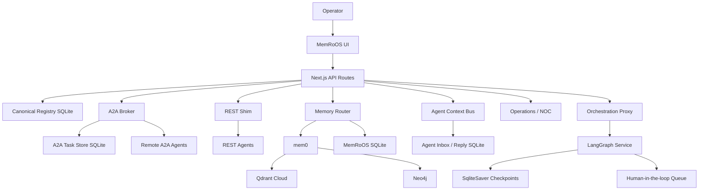

# MemRoOS Architecture

MemRoOS is an agent operating system with a broker kernel at its center. The kernel registers and authenticates agents, routes work across protocol boundaries, records memory and tool-use receipts, and gives the operator a durable control surface. It does not try to replace every agent framework's runtime; it standardizes identity, transport, memory, governance, and observability around them.

## Broker Kernel

The kernel is the Next.js app in `apps/memroos`. It owns the request boundary, UI, registry, governance checks, and durable SQLite state.

## Shipped Module Map

| Domain | Primary routes | Primary modules | Responsibility |
| --- | --- | --- | --- |
| Agent registry | `/api/agents`, `/api/remote-agents`, `/api/heartbeat` | `lib/agent-registry.ts`, `lib/db-schema.ts` | Canonical agent identity, API keys, heartbeats, capabilities, and remote polling config |
| A2A broker | `/api/a2a`, `/.well-known/agent-card.json`, `/tasks` | `lib/a2a`, `lib/agent-registry.ts` | A2A task lifecycle, agent cards, durable task state, SSE task updates |
| REST shim | `/api/agent-memory`, `/api/tool-attention`, `/api/model-routing` | `lib/tool-attention.ts`, `lib/model-routing.ts` | Bearer-key write paths for non-A2A agents and runtime telemetry |
| Memory | `/api/memory`, `/api/recall`, `/api/memory-inventory` | `lib/memory`, `lib/memory-recall-evals.ts`, `lib/recollection-policy.ts` | Vector, graph, episodic memory, recall evaluation, and proactive recollection policy |
| Agent context bus | `/api/agent-context`, `/api/agent-peers` | `lib/agent-context-bus.ts`, `lib/agent-context-policy.ts` | Durable inbox, reply, acknowledgement, and peer communication flows |
| Orchestration | `/api/orchestration`, `/api/chat`, `/api/dispatch` | `lib/orchestration`, `lib/hil`, `lib/dispatch` | Thin proxy to routed execution, chat dispatch, and human approval state |
| SkillForge | `/api/skillforge`, `/api/skills`, `/api/seal` | `lib/skillforge`, `lib/skills`, `lib/seal` | Skill lifecycle, proposal generation, evaluation, approval, and rollback |
| Governance and audit | `/api/audit`, `/api/classification`, `/api/evidence` | `lib/audit`, `lib/classification`, `lib/compliance`, `lib/evidence` | Classification, audit events, evidence bundles, and policy receipts |
| Operations and observability | `/api/operations`, `/api/agent-runtime/observability`, `/api/model-usage` | `lib/efficiency-telemetry.ts`, `lib/memory-trace-observability.ts`, `lib/api-client.ts` | NOC panels, efficiency events, memory traces, usage metrics, and operator read models |
| Knowledge and library | `/api/knowledge`, `/api/library`, `/api/meeting` | `lib/library`, `lib/knowledge-collections.ts`, `lib/context-sources.ts` | Curated knowledge, source contracts, cookbooks, notebooks, and meeting-derived artifacts |

## Service Boundaries

Long-running or compute-heavy work runs outside the Next.js kernel as a service. These services are peers of the broker kernel, not hidden modules inside it.

| Service | Path | Owner role |
| --- | --- | --- |
| Orchestration service | `services/orchestration` | LangGraph graphs, checkpoints, retry metadata, and HIL execution state |
| Memory service | `services/memory` | mem0 integration, embedding queue, Qdrant and Neo4j bridge behavior |
| Knowledge MCP service | `services/knowledge-mcp` | MCP-accessible knowledge search and indexed source lookup |
| Voice service | `services/voice-server` | STT/TTS relay and meeting/voice runtime support |

## Script Boundaries

`scripts/` is operator tooling. Scripts provision, validate, install, migrate, run evals, or perform one-shot maintenance. They should run to completion and exit unless their filename and docs explicitly describe a daemon launcher.

Examples:

- Provisioning: `scripts/provision-agent-keys.sh`
- Runtime validation: `scripts/check-runtime-topology.mjs`, `scripts/check-local-footprint.mjs`
- Evals: `scripts/run-marketplace-memory-evals.mjs`, `scripts/run-comparative-retrieval-evals.mjs`
- Installers and launchers: `scripts/install-runtime-services.mjs`, `scripts/launchd-start.sh`

## Placement Rules

| Put it in | Use when | Do not use for |
| --- | --- | --- |
| `apps/memroos/src/app` | HTTP routes, App Router pages, UI route boundaries, and request-time handlers | Long-running worker loops or batch jobs |
| `apps/memroos/src/lib` | Shared TypeScript domain logic used by routes, UI, tests, and scripts | Browser-only component state or Python service logic |
| `services` | Persistent Python processes, LangGraph runtimes, embedding queues, MCP servers, voice services, and other off-process loops | Thin CRUD routes or UI rendering |
| `scripts` | One-shot checks, provisioning, eval runners, migration helpers, launchd installers, and operational maintenance | Request/response behavior or business logic that must be imported by routes |
| `docs` and `.planning` | Architecture contracts, operator-facing decisions, GSD requirements, phase plans, verification notes | Runtime source of truth for behavior |

### `src/lib/` internal structure (LIBNORM-01, Phase 189)

Within `apps/memroos/src/lib`, domain logic lives in `lib/<domain>/`. The
`lib/` **root** is reserved for cross-cutting primitives that genuinely belong
to no single domain:

| Reserved at `lib/` root | Why |
| --- | --- |
| `env.ts` | Environment resolution, used by every domain |
| `db.ts` | Connection handle, not domain behavior |
| `paths.ts` | Filesystem layout, used by every domain |
| `constants.ts` | Cross-domain constants |
| `api-error.ts` | Shared error shape across all routes |

Everything else belongs in a domain directory — `lib/memory/`, `lib/agent/`,
`lib/store/`, and so on. The test: if a reader has to open the file to learn
which part of the system it serves, it is domain logic and needs a directory.

This rule is enforced by `npm run check:lib-boundary` (LIBNORM-03). A new
root-level file fails CI. The 75 files currently at the root predate the rule
and are listed as a shrinking baseline in `src/lib/lib-boundary-baseline.mjs`;
that list may only get smaller. Relocations use call-graph-aware `rename`, not
find-and-replace.

A related boundary applies to data access: `better-sqlite3` may only be
imported from `lib/store/**` or test files, enforced by
`npm run check:sqlite-allowlist` (STORE-03). Governance fields are required
arguments on `lib/store` write paths, so an ungoverned write does not typecheck.

Rule of thumb:

- If it serves an HTTP request or renders UI, start in the Next.js app.
- If it needs a persistent event loop, Python ecosystem runtime, embedding queue, or MCP process, put it under `services`.
- If it runs once, validates state, installs config, or produces a report, put it under `scripts`.
- If multiple runtimes need the same contract, define the schema or manifest once and generate or validate consumers from it.

## Fleet plane

MemroOS acts as the top-layer agent fleet plane across all runtimes (Hermes, Claude Code, Codex, OpenClaw, Cursor, Qwen, Gemini, ZCode, OpenCode). LangGraph is a peer orchestration runtime inside the MemroOS boundary, not a competing control plane. Paperclip is treated as a parallel product plane that subscribes as one tenant via its existing adapters (`hermes_gateway`, `openclaw-gateway`, MCP, A2A). This split keeps registry, governance, memory, and NOC ownership in MemroOS while delegating per-company task lifecycle, budget hard-stop, and board UI to Paperclip. See the binding architecture decision in [`content/architecture/memroos-as-agent-fleet-plane-2026-07-08.md`](../content/architecture/memroos-as-agent-fleet-plane-2026-07-08.md), the validation artifact in [`content/architecture/memroos-fleet-plane-validation-glm52-2026-07-09.md`](../content/architecture/memroos-fleet-plane-validation-glm52-2026-07-09.md), and the honest adapter maturity view in [`docs/runtime-adapter-maturity.md`](runtime-adapter-maturity.md).

## Deployment Boundaries

Recommended startup deployment:

- MemRoOS runs on one host.
- Agents run on one or more machines.
- Machines communicate over Tailscale or a trusted LAN.
- `MEMROOS_OPERATOR_API_KEY` protects operator writes.
- Agents use per-agent bearer keys for runtime writes.

Cloud deployment:

- Put MemRoOS behind HTTPS.
- Require operator key.
- Use managed secrets.
- Restrict A2A card ingestion to approved card URLs and networks.

## Data Stores

| Store | Owner | Purpose |
| --- | --- | --- |
| SQLite `data/conversations.db` | MemRoOS kernel | Registry, A2A tasks, reports, audit, episodic memory, agent bus, and operational telemetry |
| Qdrant Cloud | mem0 | Vector memory |
| Neo4j | mem0 / MemRoOS graph routes | Graph memory |
| Orchestration SQLite | LangGraph service | Checkpoints and HIL state |

### SQLite Ownership Split

MemRoOS and the LangGraph orchestration service each own separate SQLite files
and never open each other's database directly. Communication is always over HTTP.

| SQLite file | Owner | Path | Tables / Contents |
| --- | --- | --- | --- |
| MemRoOS canonical registry | MemRoOS kernel | `apps/memroos/data/` (or `SQLITE_DB_PATH`) | Registry, A2A tasks, audit, episodic memory, agent bus, telemetry |
| LangGraph checkpoints | LangGraph service | `data/orchestration.db` (or `ORCHESTRATION_DB_PATH`) | `checkpoints`, `writes` (LangGraph `SqliteSaver`); `orchestration_runs`, `orchestration_lineage`, `orchestration_hil_decisions` (MemRoOS engine layer) |

Within `data/orchestration.db`, the `checkpoints` and `writes` tables are
created and managed exclusively by LangGraph's `SqliteSaver`. The
`orchestration_runs`, `orchestration_lineage`, and `orchestration_hil_decisions`
tables are created and managed by the MemRoOS engine layer
(`OrchestrationStore`). They share a single file for operational simplicity and
WAL-mode concurrent access, but ownership is disciplined: each layer only writes
its own tables. See the [LangGraph Peer Contract](integrations/langgraph.md#checkpoint-store-layout)
for the full table-level ownership breakdown and durability path.

## Design Choices

- **Agent OS over app dashboard:** MemRoOS provides identity, memory, governance, routing, and observability as operating-system services for agents.
- **Thin broker over smart monolith:** The kernel coordinates and observes; specialized runtimes keep their own execution loops.
- **A2A first, REST compatible:** Prefer standards where they exist, keep a pragmatic shim for frameworks still catching up.
- **Private network first:** Multi-machine startup deployments should start on Tailscale/LAN before public exposure.
- **Explicit registration:** Agents become canonical only after registry registration or A2A card ingestion.
- **Native governance spine:** Agent actions, memory use, indexing, export, and audit follow the same `Actor -> Action -> Asset -> Purpose -> Label -> Decision -> AuditEvent` contract. See [governance.md](governance.md).
